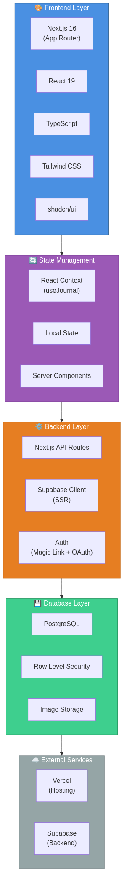
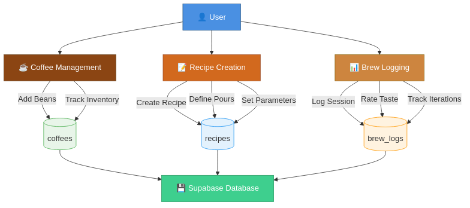
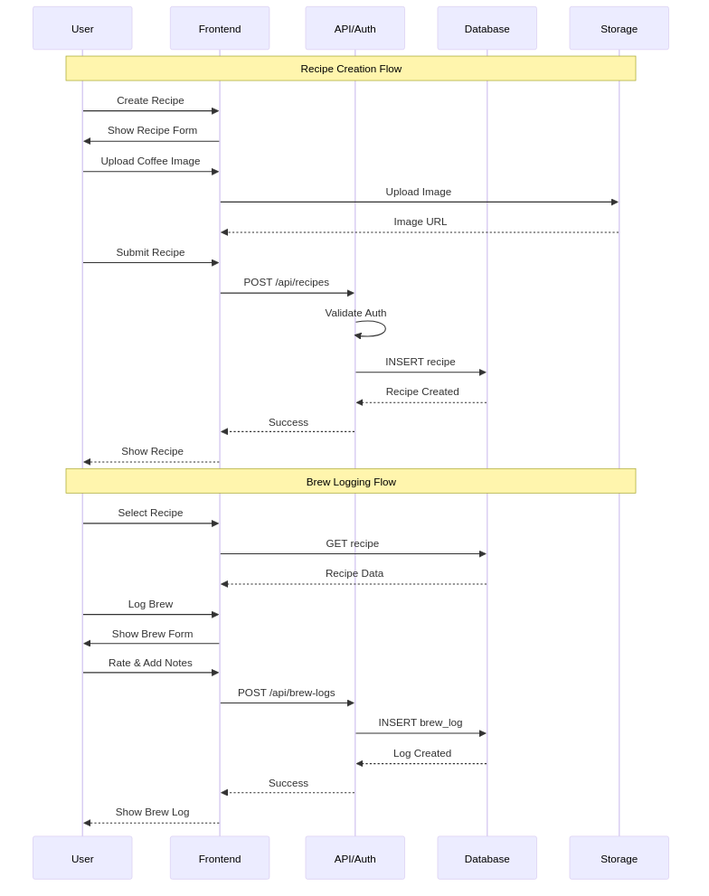

# ☕ Coffee Journal

A modern, full-stack web application for coffee enthusiasts to track their brewing recipes, log tasting sessions, and perfect their craft.

## 📖 Overview

Coffee Journal is a comprehensive brewing companion that helps you:
- **Manage Coffee Beans**: Track your coffee inventory with detailed origin, roast, and flavor profiles
- **Create Recipes**: Design and save detailed brew recipes with precise pour schedules
- **Log Brew Sessions**: Record tasting notes, rate your brews, and track iterations
- **Share & Discover**: Make recipes public to share with the community

## 🎯 Key Features

### Coffee Management
- Add coffee beans with detailed metadata (origin, farm/producer, altitude, variety, process)
- Upload and crop coffee images with rotation support
- Track roast levels and flavor profiles
- Archive beans when finished

### Recipe Creation
- Support for multiple brew methods (V60, Chemex, AeroPress, French Press, Espresso, etc.)
- Precise parameter control (coffee weight, water weight, grind size in microns, temperature)
- Detailed pour schedules with timing and water amounts
- Custom grinder click conversions
- Public/private recipe sharing

### Brew Logging
- Log brew sessions with taste profiles (acidity, sweetness, body, bitterness)
- 5-star rating system
- Upload up to 5 photos per brew
- Track recipe tweaks and iterations
- Detailed notes for improvement

### Image Handling
- **Paste from clipboard** (Ctrl/Cmd+V)
- **Edit uploaded images** with re-cropping
- **Rotate images** (0-360°)
- Automatic image optimization
- CORS-compliant cross-origin image support

## 🏗️ Architecture



### Tech Stack

**Frontend:**
- Next.js 16 (App Router) with React 19
- TypeScript for type safety
- Tailwind CSS for styling
- shadcn/ui component library
- Framer Motion for animations

**Backend:**
- Next.js API Routes
- Supabase (PostgreSQL + Auth + Storage)
- Row Level Security (RLS) for data isolation
- Server-Side Rendering (SSR)

**Authentication:**
- Magic Link (Email)
- Google OAuth
- Supabase Auth

**Hosting:**
- Vercel (Frontend)
- Supabase (Backend & Database)

## 📊 Data Flow



### Database Schema

**coffees**
- Coffee bean information (name, roaster, origin, farm, altitude, variety, process)
- Roast level and flavor profiles
- Image URLs
- Owner tracking with RLS

**recipes**
- Brew method and parameters
- Pour schedules (time, water amount, temperature, notes)
- Grind size (microns), coffee/water weights
- Public/private visibility
- Owner tracking with RLS

**brew_logs**
- Brew session records
- Taste profiles (acidity, sweetness, body, bitterness)
- Ratings and notes
- Recipe tweaks/overrides
- Photo uploads
- Owner tracking with RLS

**user_settings**
- Preferred grinder
- UI preferences
- Locale settings

## 🔄 User Flows



### Recipe Creation Flow
1. User creates a new recipe
2. Uploads coffee image (with paste/edit/rotate support)
3. Defines brew parameters and pour schedule
4. Submits recipe to database
5. Recipe is saved with owner ID and visibility settings

### Brew Logging Flow
1. User selects a recipe
2. Logs a brew session
3. Rates taste profile and adds notes
4. Optionally uploads photos
5. Brew log is saved with recipe reference

## 🌍 Internationalization

- **English** (en)
- **Spanish** (es)

Powered by `next-intl` with full translation support across all UI elements.

## 🚀 Getting Started

### Prerequisites
- Node.js 18+ or Bun
- Supabase account
- Vercel account (for deployment)

### Installation

```bash
# Clone the repository
git clone https://github.com/yourusername/coffee-journal.git
cd coffee-journal

# Install dependencies
bun install

# Set up environment variables
cp .env.example .env.local
# Add your Supabase credentials

# Run database migrations
# (See supabase/migrations/)

# Start development server
bun dev
```

### Environment Variables

```env
NEXT_PUBLIC_SUPABASE_URL=your_supabase_url
NEXT_PUBLIC_SUPABASE_ANON_KEY=your_supabase_anon_key
```

## 📁 Project Structure

```
coffee-journal/
├── app/                    # Next.js App Router
│   └── [locale]/          # Internationalized routes
├── components/            # React components
│   ├── brew-log/         # Brew logging components
│   ├── coffee/           # Coffee management
│   ├── recipe/           # Recipe components
│   ├── shared/           # Shared components
│   └── ui/               # shadcn/ui components
├── lib/                   # Utilities and helpers
│   ├── db-client.ts      # Supabase client (client-side)
│   ├── db-server.ts      # Supabase client (server-side)
│   ├── types.ts          # TypeScript types
│   ├── images.ts         # Image processing
│   └── grinders.ts       # Grinder conversions
├── messages/             # i18n translations
│   ├── en.json
│   └── es.json
├── supabase/             # Database migrations
└── docs/                 # Documentation & diagrams
```

## 🔒 Security

- **Row Level Security (RLS)**: All database tables use RLS policies
- **Authentication**: Supabase Auth with magic links and OAuth
- **Data Isolation**: Users can only access their own data
- **Public Recipes**: Optional public sharing with read-only access
- **Image Storage**: Secure Supabase Storage with signed URLs

## 🧪 Testing

```bash
# Run tests
bun test

# Run tests in watch mode
bun test --watch
```

## 📝 License

This project is private and not licensed for public use.

## 🤝 Contributing

This is a personal project. Contributions are not currently accepted.

## 📧 Contact

For questions or feedback, please open an issue.

---

**Built with ☕ and ❤️**
